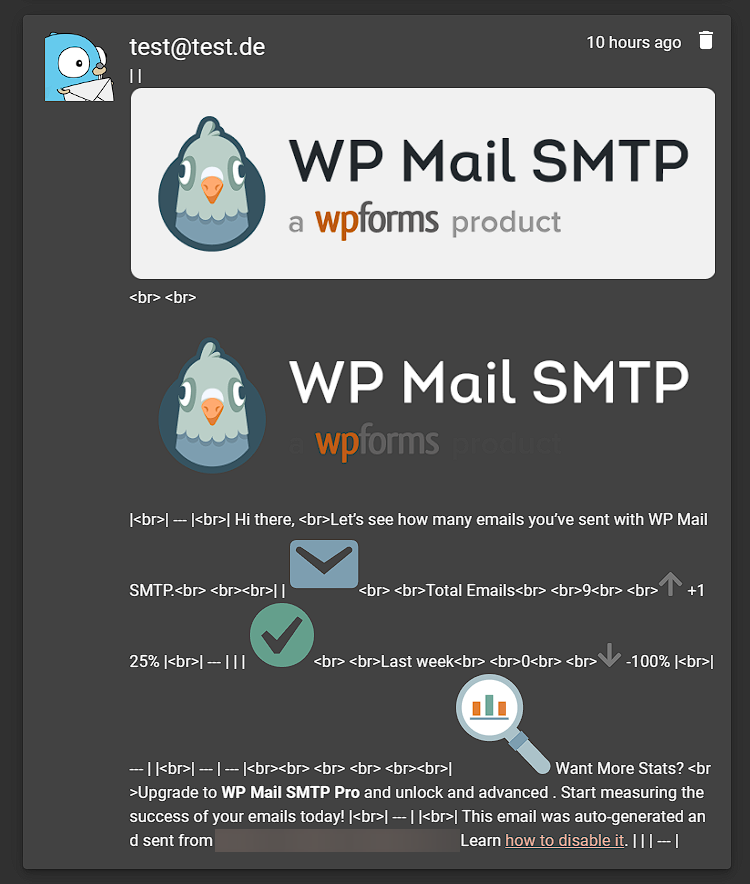

# GotifySmtpForwarder

Forwards e-mails to a Gotify application.

## About

This project spawns an SMTP server and forwards received e-mail messages to a [Gotify](https://gotify.net/) application
of your choice. If the message body contains HTML it gets automatically sanitized and converted to Markdown! 

## Why?

A lot of popular web applications (like WordPress) only support notifying you via SMTP or via plugins you need to
install and keep an eye on. This little service can run alongside e.g. a WordPress container and receive messages from
it. The messages will then be forwarded to a Gotify server you can host yourself, so no need to have a mail gateway or
relay and deal with the complications of them.

## TODOs

- Improve cleaning up the HTML before and/or after Markdown conversion to get rid of artefacts like shown here:  
  
  Looks like tables used to style the body get mangled especially badly right now. More testing required.

## 3rd party credits

Many thanks to these awesome projects that do the heavy lifting under the hood ♥

- [SmtpServer](https://github.com/cosullivan/SmtpServer)
- [Refit](https://github.com/reactiveui/refit)
- [Polly](https://www.thepollyproject.org/)
- [HtmlSanitizer](https://github.com/mganss/HtmlSanitizer)
- [ReverseMarkdown](https://github.com/mysticmind/reversemarkdown-net)
- [MimeKit](https://github.com/jstedfast/MimeKit)
